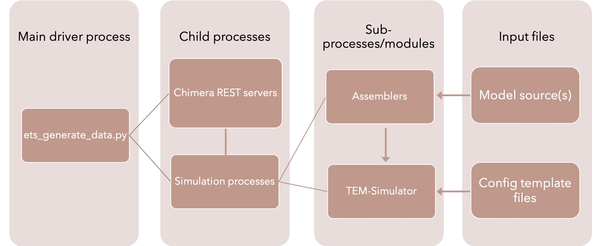

Software architecture
=====================

==========
Simulation
==========

    A high-level overview of the simulation module architecture.

Simulation of data sets are driven by the main **ets\_generate\_data.py** script. It leverages the Python *multiprocessing* and *subprocess* modules to spawn the child processes shown above. `Chimera REST servers <https://www.cgl.ucsf.edu/chimera/current/docs/ContributedSoftware/restserver/restserver.html>`_ are spawned with as subprocesses (as many as specified in the input parameters) to listen for HTTP requests from child simulation processes to assemble individual particles in the data sets. Each child simulation process is given a set of tilt stacks to generate, and uses its own Assembler module instance to create the particles it needs (through the Chimera server) for the next stack in its assignment. After the Assembler has created the source MRC files for the particles, the simulation process will leverage the simulation/tem\_simulation module to set up the necessary configuration files before running the TEM Simulator. The configuration files here are based on template files provided in the input YAML file, with specific values - like the path to the particle sources for that run - replaced. Each simulation process maintains a temp directory used to store run-specific configuration files and particle volumes.

-------
Logging
-------

Logging for the **ets\_generate\_data.py** module is handled by a Python *logger* instance configured to handle the multiprocessing child processes by taking log messages from a multiprocessing queue. Child processes setting up and running TEM Simulator runs will enqueue log messages to the multiprocessing messages queue it is passed on creation, with the main logger process listening for and pulling from the queue.

----------
Assemblers
----------

Assembler modules define and send the Chimera requests to create and save a new particle to add to a simulation. Assembler implementations at minimum should implement the **set\_up\_tiltseries** method (called by child processes in the main data generation process to create a new particle), the **reset\_temp\_dir** method to clean up any resources placed in the child process temp directory (usually the particle volumes created for the individual simulation), and the **close** method to do any last minute clean-up for the Assembler instance (by default just letting the Chimera server know that the specific Assembler instance, and thus the simulation child process using it, is done with its assigned number of tilt stacks). Refer to the **assemblers/basic\_assembler** module to look at a minimal implementation of these features.