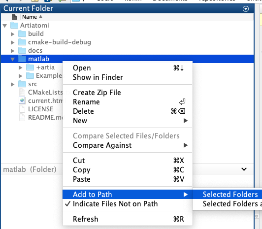

.. _artiatomi_processor:

The Artiatomi Processor
=======================

Introduction
------------

The Artiatomi Processor attempts to help along processing of data with the `Artiatomi software <https://github.com/uermel/Artiatomi>`_. It assumes that you have a working set of the Artiatomi command line tools (either built from the source or through the `Artiatomi Docker image <https://github.com/kmshin1397/artiatomi-tools>`_).

As the standard Artiatomi workflow generally involves Matlab driver scripts along with calling the Artiatomi command line tools where needed, the Artiatomi Processor mainly attempts to generate these Matlab scripts for the user to run.

The Artiatomi Processor must start with an IMOD project (either simulated or real data) that has at least gone through the tiltseries alignment process. This is because while Artiatomi does provide its own bead tracking and alignment workflow (through the Clicker tool) there is no automatic alignment native to Artiatomi and for the streamlined processing ETSimulations is designed for, we would like to take advantage of the automatic alignment provided through IMOD.

As with any of the other processors, parameters are provided in a YAML file fed into the ets\_process\_data.py program. The parameters taken are discussed below.

A note on EMAN2
^^^^^^^^^^^^^^^
EMAN2 source projects are unfortunately not supported at this time. EMAN2 uses significantly different alignment parameters from IMOD and Artiatomi, so it is challenging to support doing Artiatomi's EmSART reconstruction based off of EMAN2 aligned stacks.

It is possible to use particles extracted from EMAN2 and perform sub-tomogram averaging on them using Artiatomi's SubTomogramAverageMPI. However, this is not supported by the Artiatomi Processor either because SubTomogramAverageMPI is functionally equivalent to performing the STA on EMAN2 particles through Dynamo (supported in the Dynamo Processor). The distinguishing factor of Artiatomi's sub-tomogram processing is the local refinement step which can be performed after the STA step, but this requires the original tiltseries and alignment parameters in the Artiatomi format which we are unable to retrieve when starting from EMAN2 projects. Thus, the decision was made to forgo EMAN2 importation with the Artiatomi Processor for now.

Parameters
----------

The Artiatomi Processor, like all others, have the **name** argument ("artiatomi") and an **args** object filled with parameters. (Remember that the overall YAML file must include a **root** and **name** argument as well)

General parameters
^^^^^^^^^^^^^^^^^^

    * **real_data_mode** : bool
        Enable this to let the Artiatomi Processor know that you are processing real data and to use the other parameters below rather than assuming the directory/file naming patterns used by IMOD Processor.

    * **setup_reconstructions_and_motls** : bool
        Enable this to tell the Artiatomi Processor to generate the necessary scripts to set up reconstructing the tomograms in the project with EmSART and convert either the .mod files (if using real IMOD data) or the recorded simulation metadata (for simulated data) into Artiatomi-format particle motivelists.

    * **setup_averaging** : bool
        Enable this to tell the Artiatomi Processor to generate the script for setting up a run of Artiatomi's SubTomogramAverageMPI for the project.

    * **setup_refinement** : bool
        Enable this to tell the Artiatomi Processor to generate the scripts to be used for the local refinement and re-extraction of particles based on the refined alignments.

Artiatomi-specific parameters
^^^^^^^^^^^^^^^^^^^^^^^^^^^^^

    * **output_suffix** : string
        A suffix string to attach to the tiltseries base name in order to come up with the EmSART reconstruction output names. For example, a tiltseries called "T4SS_0.st" and an output_suffix of "_SART_HR_1k.em" will result in the final tomogram being named "T4SS_0_SART_HR_1k.em".

    * **tomogram_size_x** : int
        The reconstructed tomogram's size in the X dimension (in number of pixels)

    * **tomogram_size_y** : int
        The reconstructed tomogram's size in the Y dimension (in number of pixels)

    * **tomogram_size_z** : int
        The reconstructed tomogram's size in the Z dimension (in number of pixels)

    * **position_binning** : int
        (Required only for simulated data) The binning factor to apply to the original positions recorded when generating the data so that they match the final tomogram size. For example, if you simulated 2k tiltseries but are reconstructing 1k tomograms, this parameter should be set to 2.

    * **reconstruction_template_config** : string
        A file path to a template EmSART configuration file to use for reconstructing the tomograms in the project. An example for a low-contrast, high-resolution reconstruction is provided in the templates/artiatomi folder. For more information on the configuration file, refer to `the official Artitomi wiki page. <https://github.com/uermel/Artiatomi/wiki/EmSART-%28cfg-file%29>`_

    * **emsart_path** : string
        (Used if setting up reconstructions) The file path to the EmSART compiled executable, if you are working with Artiatomi built from source, or just "EmSART" if it is already on your system's PATH variable. If you are using the Artiatomi Docker image, this can be just set to "EmSART".

    * **emsart_subvols_path** : string
        (Used if setting up refinement) The file path to the EmSARTSubVols compiled executable, if you are working with Artiatomi built from source, or just "EmSARTSubVols" if it is already on your system's PATH variable. If you are using the Artiatomi Docker image, this can be just set to "EmSARTSubVols".

    * **box_size** : int
        (Used in averaging and refinement) The box size for your extracted particles

The following seven parameters are all parameters for the SubTomogramAverageMPI program. Refer to `the Artiatomi wiki page <https://github.com/uermel/Artiatomi/wiki/SubTomogramAverageMPI-%28cfg-file%29>`_ for their details.

    * **angIter** : int

    * **angIncr** : float

    * **phiAngIter** : int

    * **phiAngIncr** : float

    * **lowPass** : int

    * **highPass** : int

    * **sigma** : int

Real data mode parameters
^^^^^^^^^^^^^^^^^^^^^^^^^^^
    * **imod_dir** : string
        (Required only if **real\_data\_mode** is set to true) The IMOD project directory to transfer to an Artiatomi project

    * **artia_dir** : string
        (Required only if **real\_data\_mode** is set to true) The destination directory to create the Artiatomi project in

    * **dir_contains** : string
        (Required only if **real\_data\_mode** is set to true) When iterating through the IMOD directory, take only the sub-directories containing this string as tomogram data directories to import into Artiatomi

    * **mod_contains** : string
        (Required only if **real\_data\_mode** is set to true) When looking for the particle MOD file in a directory, look for .mod files containing this string

Further details by step
-----------------------

Reconstruction and Motivelist
^^^^^^^^^^^^^^^^^^^^^^^^^^^^^
Tied to the **setup_reconstructions_and_motls** option, the reconstruction and motivelist step works by generating a Matlab script called *setup_artia_reconstructions.m* and a bash script called *emsart_reconstruct.sh* in your Artiatomi project folder. Additionally, the Artiatomi Processor will copy over each tiltseries, .tlt file, and .xf file from the IMOD data directories into a newly created Artiatomi project directory.

The *setup_artia_reconstructions.m* will iterate through all of your tiltseries and import them into Artiatomi format by generating `Artiatomi Marker files <https://github.com/uermel/Artiatomi/wiki/Marker-file>`_ out of the IMOD alignment files. Additionally, the script will create `Artiatomi motivelist files <https://github.com/uermel/Artiatomi/wiki/Motivelist>`_ based on information parsed from either your .mod IMOD files (if using real data) or from metadata recorded during the simulation (for simulated data).

Once the Artiatomi Processor has completed generating the *setup_artia_reconstructions.m* script, you should open it in Matlab and run it. Before you do so, you must add the Artiatomi *matlab* folder to your Matlab path in order for Matlab to recognize the Matlab functions packaged in the Artiatomi software. See the screenshot below showing the "Add to path" step.

    Adding Artiatomi's matlab functions to the Matlab path

After you successfully run the Matlab script, you should run ::

    chmod +x emsart_reconstruct.sh

after you *cd* to your Artiatomi project directory in order to enable running the bash script. This bash script will iterate through the data directories and actually run EmSART in order to reconstruct the tomograms. If you are using the Artiatomi Docker, remember that you must run this script from inside the container, where the EmSART program actually resides.

Averaging
^^^^^^^^^
Tied to the **setup_averaging** option, the sub-tomogram averaging step of the Artiatomi Processor consists of creating a *setup_artia_sta.m* file for your Artiatomi project, as well as setting the necessary directory structure for sub-tomogram averaging.

The *setup_artia_sta.m* script will generate the SubTomogramAverageMPI configuration file based on the parameters you put in the YAML file, along with default values for other options. Additionally, some default masks and wedge files will be created based on the box size you specified.

This script will probably require some manual intervention from you to get the desired averaging results. The mask file created will be spherical with a radius half the box size by default, but you may of course want to modify this. Similarly the wedge file and the maskCC file (the cross-correlation mask used to limit particle translation) will likely often be modified.

Note specifically that the wedge file (used to account for the missing wedge) must know the proper tilt scheme range, which is currently set to -54 to 54 degrees by default. This should be modified in line 117 of *setup_artia_sta.m* if your tilt scheme does not match these angles.

Finally, you will also want to consider modifying the EndIteration parameter of the STA run (specified in line 149 of *setup_artia_sta.m*) to run more iterations of the averaging. If you have multiple GPU devices available of similar computing capabilities, you can choose to use multiple GPUs by modifying the CudaDeviceID field in line 130 of *setup_artia_sta.m* to list multiple IDs.

Of course, all of these STA configuration fields can be modified directly in the generated .cfg file after the Matlab script is run as you would do in a traditional Artiatomi processing workflow.

After the STA setup is complete, you will need to generate an initial reference -  either by running the AddParticles program of Artiatomi with the generated *sta.cfg* file as input or by providing your own reference map in .em format. After you have an initial reference (named ref1.em inside the sta/ref folder in your Artiatomi project directory), run SubTomogramAverageMPI using the generated *sta.cfg* file as input to perform the sub-tomogram averaging.

Refinement
^^^^^^^^^^
Tied to the **setup_refinement** option, the local refinement step of the Artiatomi Processor generates two Matlab scripts, *refin_align.m* and *refine_extract.m*, in order to assist with utilizing EmSARTRefine and EmSARTSubVols to perform local alignment refinement based on sub-tomogram averages.

The *refine_align.m* file will set up and run local refinement iterations for all your tomograms, relying on the Matlab functions provided in `the artiatomi-tools repository <https://github.com/kmshin1397/artiatomi-tools>`_ which also provides the Artiatomi Docker container. You will need to add the matlab folder in the artiatomi-tools package to your Matlab path (just like shown above with the official Artiatomi package in the reconstructions section) as well in order to run this script.

Note that the local refinement step of Artiatomi appears less stable and you may need to manually skip problematic tomograms occasionally. To do so, simply update line 111 of the *refine_align.m* script to have the for loop begin with a later index in the "tomonrs" array (which lists all tomogram numbers in your project) before running that section again.

You will probably also need to update the parameters in lines 57-66 to properly reflect paths to the various Artiatomi executables as well as a remote SSH port number if you are using the Artiatomi Docker image. Remember that the Docker image has all the executables registered in the environment PATH variable so only the program names and not the full paths are needed.

Finally, the *refine_extract.m* script will take the results of *refine_align.m* to re-extract particles based on the improved alignments; a new sub-tomomgram average configuration file will be created so you can see if the local refinements improved the average. If you ran into problematic tomograms in the refine_align step, you may need to delete the latest iteration that broke for those tomograms in the refine folder so that the *refine_extract.m* script doesn't attempt to read missing refinement outputs.

Examples
--------
Here are some basic examples of YAML segments that will drive an Artiatomi Processor run. Of course, many other parameters are available and are discussed above.

Simulated data mode: ::

    {
      name: "artiatomi",
      args: {
        real_data_mode: false,
        setup_reconstructions_and_motls: true,
        reconstruction_template_config: "/home/kshin/Documents/repositories/ETSimulations/templates/artiatomi/EmSART_HR.cfg",
        output_suffix: "_SART_HR_1k.em",
        tomogram_size_x: 1000,
        tomogram_size_y: 1000,
        tomogram_size_z: 300,
        position_binning: 2
      }
    }

Real data mode: ::

    {
      name: "artiatomi",
      args: {
        real_data_mode: true,
        setup_reconstructions_and_motls: true,
        reconstruction_template_config: "/home/kshin/Documents/repositories/ETSimulations/templates/artiatomi/EmSART_HR.cfg",
        output_suffix: "_SART_HR_1k.em",
        tomogram_size_x: 1000,
        tomogram_size_y: 1000,
        tomogram_size_z: 300,
        imod_dir: "/data/kshin/test",
        artia_dir: "/data/kshin/test/Artia",
        dir_starts_with: "dg",
        mod_contains: "T4SS_YL_2k"
      }
    }

