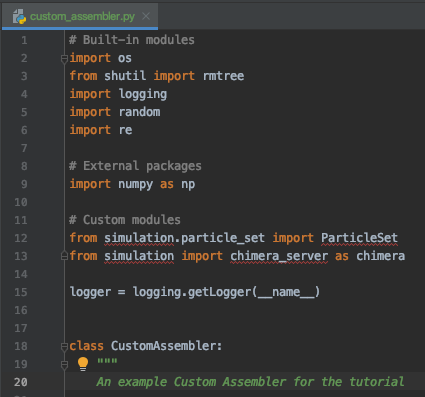
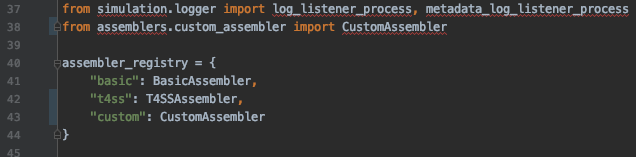
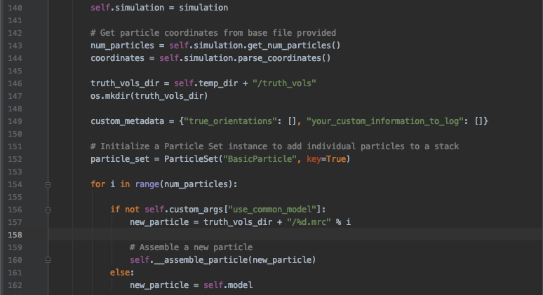
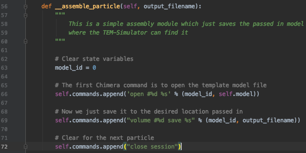
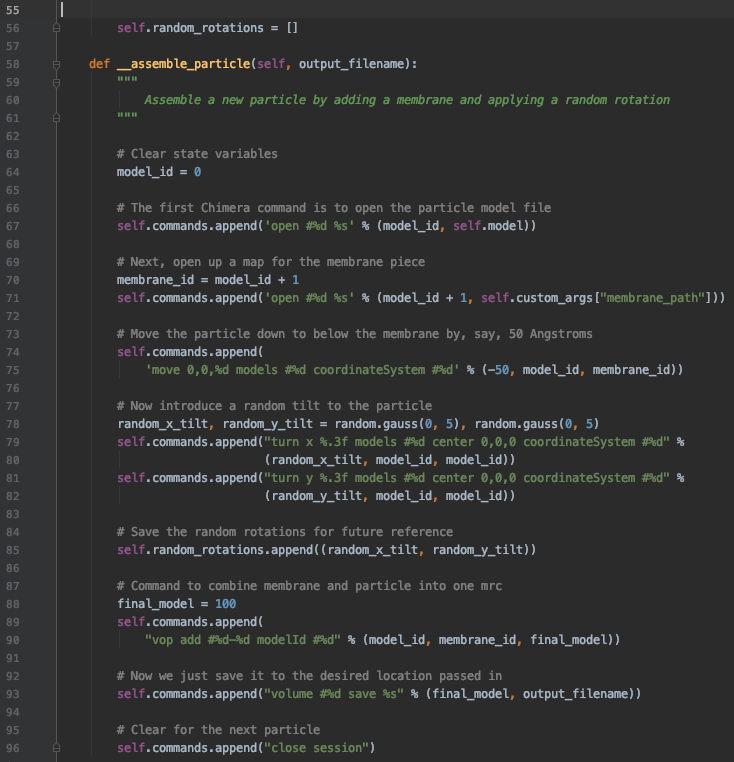
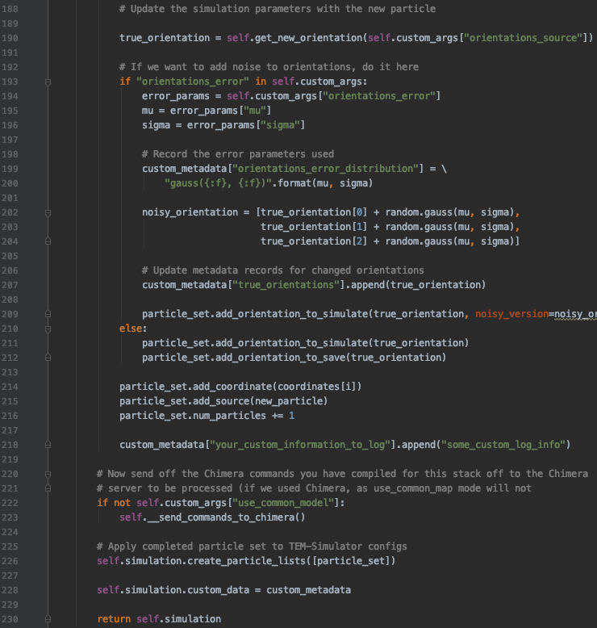

.. _guide-custom-assembler:

Making your own custom Assembler
================================
Creating your own custom Assembler class can lend far more control over the behavior of your simulated data sets. This page attempts to provide guidance on writing your own Assembler class.

Note that some level of Python proficiency is expected to pursue this task. Although it may be possible to achieve desired results with basic knowledge, the process is no doubt easier to follow the more proficient with Python and scripting you are.

What are Assemblers?
--------------------
Before we embark on creating a new Assembler, we must gain a thorough understanding of what makes up an Assembler and how Assemblers fit into the simulation pipeline of ETSimulations.

In ETSimulations, Assemblers are Python modules designed to handle the step of assembling new particle map sources for TEM-Simulator runs during a data set generation session. This includes putting together and sending off lists of commands to the Chimera REST Server in order to put together pieces of the structure you wish simulate, as well as updating the relevant input files to TEM-Simulator to properly use the source maps created.

The general workflow followed by the Basic Assembler and T4SS Assembler included with ETSimulations will for each tiltseries to be simulated:

    1. Set up a temporary "truth_vols" directory in which to store the source maps for that run of TEM-Simulator (lines 146-147 in *assemblers/basic_assembler.py*).

    2. Compile and send off commands to Chimera to assemble and save a new particle map into the truth_vols directory (if per-particle Chimera commands are needed), or simply make a copy of the template particle map into the truth_vols directory (if just using the same source map for all particles in the data set)

    3. Update the TEM-Simulator run for the tiltseries by updating the configuration and coordinates text input files and updating the metadata stored in the Simulation class instance representing that TEM-Simulator run within the program.

At minimum, a valid Assembler is expected to implement three functions: **set_up_tiltseries**, **reset_temp_dir**, and **close**. These will be discussed in more detail below. Of course, you are free to write any number of helper functions to support the Assembler logic you desire beyond these three. Even the Basic Assembler has functionality beyond the required functions (namely the different options for the particle orientations distribution).

Setting up a new Assembler
--------------------------
The first step in making a new Assembler is of course to create a new Python file for it within the src/assemblers file. The easiest approach is probably to copy the basic_assembler.py file and build off of it. As an example, we'll do just that and make a new src/assemblers/custom_assembler.py file and copy in the contents of the basic_assembler.py file. If we change the class name to "CustomAssembler", we now have a "new" Assembler which is exactly the same as the Basic Assembler.



    The CustomAssembler starting point

Before we get into modifying the functionality of our new Assembler, we must first register it with the *ets_generate_data.py* script so that it is aware of the new module. This is a simple matter of importing your new class and then adding it to the dictionary of registered Assemblers at the top of the *ets_generate_data.py* file.



    The CustomAssembler registered in ets_generate_data.py

Now that our new Assembler is properly created and linked up, we can move on to adding custom behavior.

The set_up_tiltseries function
------------------------------
Part 1
``````
This is the Assembler class function which contains all the special logic which drives the simulations. The **set_up_tiltseries** function should pretty much do all three of the general steps highlighted in the "What are Assemblers?" section above. To study this function and learn to modify it for our needs, let's walk through the current implementation which we have copied from the Basic Assembler.



    The first half of the set_up_tiltseries function

Here, you can see that the current function begins by using methods from the Simulation class (which represent information regarding runs of the TEM-Simulator) to retreive the particle coordinate info based on the text files inputted by the user. The idea, of course, is to use this to determine how many particles and where we need to place them as we set a run of the simulator.

Next, we are creating a "truth_vols" directory in which to have Chimera save assembled complexes within the temporary directory assigned to the current process. As a data set generation process will use lots and lots of individual particle maps, we keep the ones created for each tiltseries in their own temporary truth volumes folder like this. The temporary maps are deleted after the TEM-Simulator outputs to the tiltseries in order to keep ets_generate_data.py from using up too much space.

A "custom_metadata" dictionary is also initialized here. If you find yourself wanting to save any variables from within your assembler, this dictionary is the place to record them; it will be transferred to the sim_metadata.json output by the ets_generate_data.py script.

We then initialize a ParticleSet class instance for the particles in this tiltseries - this maps to a TEM-Simulator configuration particleset section. Now we must populate this ParticleSet by assembling particles.

The next if...else... block is used by the Basic Assembler to either use the __assemble_particle() function to assemble Chimera-driven particles or to just use the passed in model map if using the "use_common_model" mode. As you'll likely leverage the heterogeneity offered through Chimera, you'll want to get rid of the logic branching. However, this block does demonstrate use of the "custom_args" dictionary to use user input parameters for your custom assembler. Now let's examine the helper function __assemble_particle(), which contains the actual packaging and sending of Chimera commands.

The __assemble_particle() function
``````````````````````````````````


    The __assemble_particle function

The __assemble_particle() function does the actual assembly of a particle through Chimera. The basic example here doesn't do much, but this is where the full power of Chimera should be leveraged to introduce heterogeneity into your simulations.

For example, let's say you have a particle next to a membrane which tends to wiggle around. You could add random rotations to the particle as you combine it with the membrane map like this:



    The new __assemble_particle function

Note that we added a "random_rotations" field to the CustomAssembler class for us to keep track of the random angles generated so that we can pass it along to our custom_metadata later.

Part 2
``````
Now that we've added a custom behavior to our assembler, let's wrap up the rest of the set_up_tiltseries function.



    The second half of the set_up_tiltseries function

Most of the code here is to support the **orientations_error** option to introduce some random noise to the recorded orientations in the simulation metadata. When using the noisy orientation, the true orientations of course are still the ones passed to TEM-Simulator, but the noisy versions are the ones recorded in the "orientations" field in the metadata so that the Processors use these instead.

The code covered in this section should likely not need to be altered much, if at all, as there isn't much harm in keeping around the orientations_error option even if you don't use it. The only thing we would need to add would be a line to put the random rotation we stored in "self.random_rotations" to the custom_metadata dictionary.

In all, we'd end up with a set_up_tiltseries() function like this (along with the changes we made to the __assemble_particle() function):

.. hidden-code-block:: python
    :label: + show/hide function

    def set_up_tiltseries(self, simulation):
        """
        Implements the tiltseries set-up procedure, which consists of:

        For number of particles (i.e 4):
            1. Make a temp truth volume
            2. Assemble particle and save truth
            3. Set up sim configs and update TEM input files

        Args:
            simulation: The src.simulation.tem_simulation.Simulation object responsible for feeding
                particles assembled here to a TEM-Simulator run, passed in from the simulation child
                process running the simulation using this Assembler.
        """
        self.simulation = simulation

        # Get particle coordinates info from base file provided
        num_particles = self.simulation.get_num_particles()

        truth_vols_dir = self.temp_dir + "/truth_vols"
        os.mkdir(truth_vols_dir)

        custom_metadata = {"true_orientations": [], "your_custom_information_to_log": []}

        # Initialize a Particle Set instance to add individual particles to a stack
        particle_set = ParticleSet("CustomParticle", key=True)

        for i in range(num_particles):
            # Get particle coordinates, with random errors applied for this tiltseries, if desired
            coordinates = self.simulation.parse_coordinates()

            new_particle = truth_vols_dir + "/%d.mrc" % i

            # Assemble a new particle
            self.__assemble_particle(new_particle)

            # Update the simulation parameters with the new particle
            true_orientation = self.get_new_orientation(self.custom_args["orientations_source"])

            # If we want to add noise to orientations, do it here
            if "orientations_error" in self.custom_args:
                error_params = self.custom_args["orientations_error"]
                mu = error_params["mu"]
                sigma = error_params["sigma"]

                # Record the error parameters used
                custom_metadata["orientations_error_distribution"] = \
                    "gauss({:f}, {:f})".format(mu, sigma)

                noisy_orientation = [true_orientation[0] + random.gauss(mu, sigma),
                                     true_orientation[1] + random.gauss(mu, sigma),
                                     true_orientation[2] + random.gauss(mu, sigma)]

                # Update metadata records for changed orientations
                custom_metadata["true_orientations"].append(true_orientation)

                particle_set.add_orientation_to_simulate(true_orientation, noisy_version=noisy_orientation)
            else:
                particle_set.add_orientation_to_simulate(true_orientation)
                particle_set.add_orientation_to_save(true_orientation)

            particle_set.add_coordinate(coordinates[i])
            particle_set.add_source(new_particle)
            particle_set.num_particles += 1

        # Now send off the Chimera commands you have compiled for this stack off to the Chimera
        # server to be processed
        self.__send_commands_to_chimera()

        # Put all the random rotations used in the custom metadata
        custom_metadata["random_rotations"] = self.random_rotations

        # Apply completed particle set to TEM-Simulator configs
        self.simulation.create_particle_lists([particle_set])

        self.simulation.custom_data = custom_metadata

        return self.simulation


The reset_temp_dir and close functions
--------------------------------------
Finally, the **reset_temp_dir()** function is there to clean up anything you decide to put in to the temporary directories in between runs of the TEM-Simulator. Currently, that would just be to delete the entire "truth_vols" directory used to store all the particle maps, so that we can create a new set of particle in the next TEM-Simulator run.

The **close()** serves mainly to let the Chimera server know that this instance of the Assembler is done with the server for good (so that Chimera knows eventually to turn off after finishing all simulations), but any additional clean up you find yourself needing to do before being done the CustomAssembler instance could be done here.

For the custom assembler we have made, there isn't anything much we need to change from the basic versions of these functions, as we haven't changed anything drastic about the structure/workflow of the assembler class. All we need to do really is remove the last mention of the "use_common_model" option from the BasicAssembler:

.. hidden-code-block:: python
    :label: + show/hide code

    def reset_temp_dir(self):
        """
        Resets the temp directory resources for the Assembler, i.e removes current particles created

        Returns: None

        """
        rmtree(self.temp_dir + "/truth_vols")

    def close(self):
        """
        Lets the Chimera server know that this Assembler is done for good

        Returns: None

        """
        # Let the Chimera server know that this Assembler is done using the server
        self.commands = ["END"]
        self.__send_commands_to_chimera()

Conclusion
----------
And there we have it: a new CustomAssembler which applies random small rotations in the X and Y axis to the main particle with respect to a membrane segment map being combined to it.

The general takeaway is to add the Chimera commands necessary for the particle-by-particle variation you would like to introduce into the __assemble_particle() function, and to record those changes in the custom_metadata in case you need that information later. This is, of course, a relatively simple modification and the flexibility is there to do much more elaborate things with your custom assemblers. For example, you could envision setting up an entire list of protein maps and randomly choosing from them to be placed next to each generated particle in order to simulate all the different densities that may exist around your particle.

Hopefully this guide provides the basic knowledge and strategies necessary to develop and implement your own modification ideas.